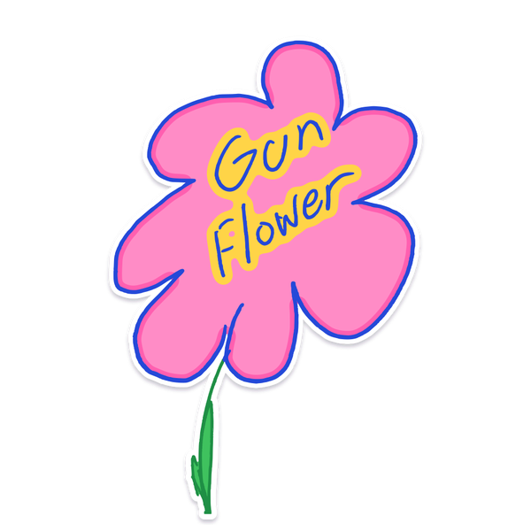
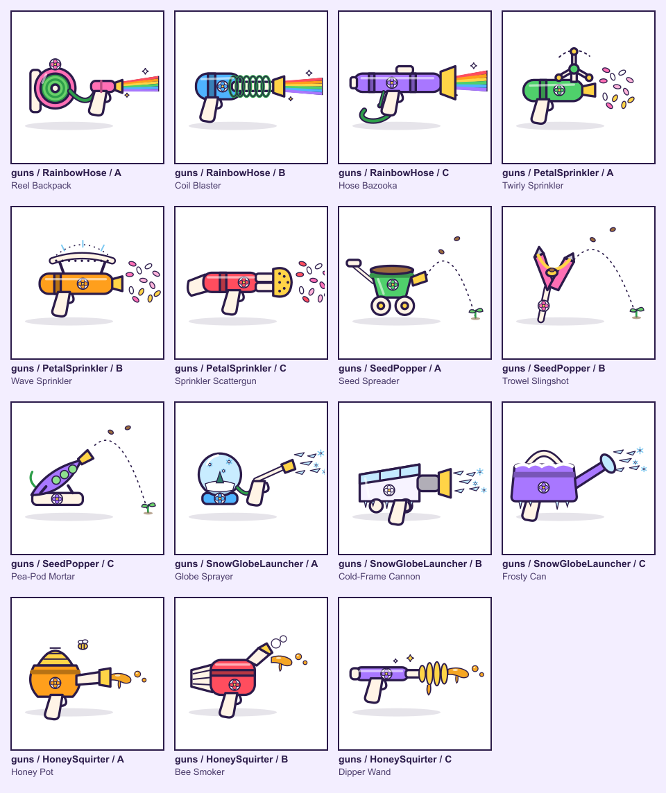
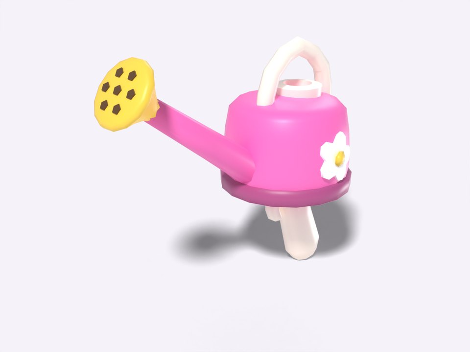
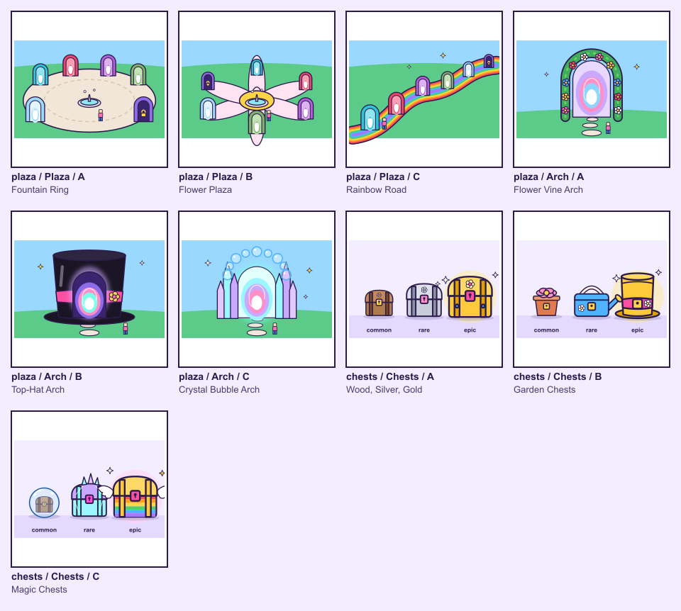
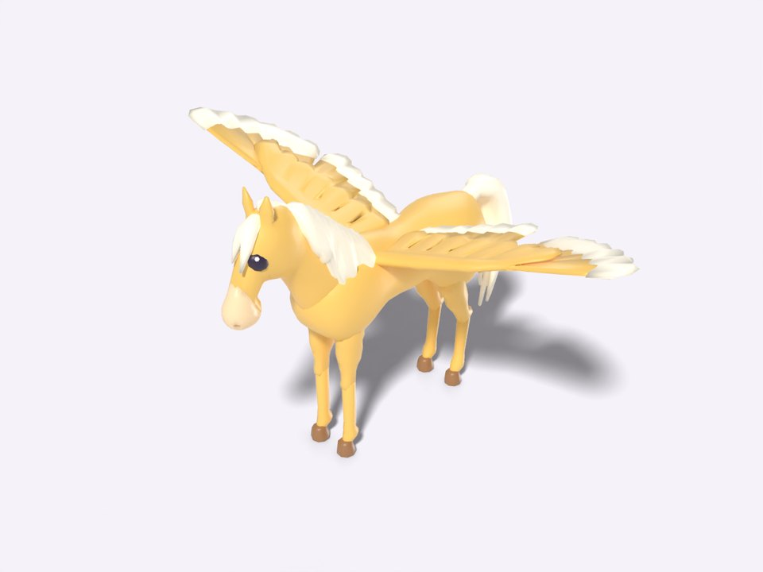

# Gun Flower: Clara H.'s game



Gun Flower is the game this kit grew out of. Clara H. designed it, her dad set things up and kept it safe, and
Claude Code built it, in about a day in October 2026. Clara made every creative decision. This page tells the story
the way the [parent's guide](../../guide/README.md) is laid out, so you can see each phase happening for real.

In Gun Flower you pick magic flowers, take them to a lotus pool, and turn them into garden-tool blasters: a watering
can that blows bubbles, a pump sprayer full of confetti. Then you blast eyeless monsters in top hats, and they pop
back into flowers you can pick. There are horses with big wings, five worlds to explore, bosses, a garden to grow, and
a spooky Mystery area behind a crystal arch for brave explorers.

## 1. Dream it

Clara described the game out loud, talking it through with a voice assistant while her dad listened and helped. The
conversation became [the spec](spec.md). The recording stayed at home.

Her ideas carried the whole game:

- "**They have no eyes.**" The monsters are eyeless. It's weird and a bit creepy, and it became the game's signature.
- When you beat a monster, **it turns into a flower of its own colour**. That one idea closes the loop: flowers make
  guns, guns beat monsters, monsters make flowers.
- The guns fire **bubbles** and **confetti**, and how you win decides the celebration: bubbles rain down, or confetti
  does.
- Horses "like Horse Life", and later: **feed your horse flowers and it can fly**.
- Real flowers, starting with the 50 in the family's flower spotting book.

The spec also set one rule that settled a lot of arguments later: when choosing between something technically
impressive and something Clara will immediately find funny, **choose the funny one**.

## 2. Pick it

Claude drew the options and Clara tapped her picks on an iPad, in three rounds. Each board had three options (A, B
and C) drawn in the game's real style, plus a note box. Her notes turned out to matter as much as her taps.

| Round | What she chose from | What she picked, in her words |
|---|---|---|
| 1. The look | 8 boards: logo, world, monsters, blasters, the crafting place, horse, game screen, the Mystery area | Logo "**1A with a hand-drawn vibe**" · World B, *Bold & Bright* · Monsters "**3A, scary, not too much, top hats on them**" · Blasters "**4C, but every gun is the colour of the flower**" · Crafting place B, a lotus pool · Horse "**like Horse Life, with a cartoon edge**" (she turned down the blocky one) · Screen B, a sticker book · Mystery "**A + B**", floating islands *and* a crystal arch |
| 2. Bosses and bad guys | A boss and its bad guys for each of six worlds | Six bosses, including *The Great Gull-ini*, *Croakus Pocus* and *The Hatter of Holes*, and 17 bad guys. She didn't pick the Can Mimics, so they never made it in |
| 3. More picks | 14 boards: magic flowers, new guns, landmarks, a horse designer, reward horses, a gift calendar, a garden, a portal plaza, rainbow bridges, chests, a map, trails, a stable | Horse designer: "**everything**" (all 10 breeds, 10 patterns, 7 manes, 6 saddles, 6 hats, 6 wing styles) · Portal arches: "**all of them**" · All 12 trails · A pop-up-book world map |

Round 3 is in this folder as a real round you can open: [`round-3/`](round-3/) has four of her boards in the
[picker](../../picker/) format, her actual picks, and the `PICKS.md` Claude wrote from them. From the kit's root:

```bash
python3 picker/picker.py serve examples/gun-flower/round-3      # see the boards she saw
python3 picker/picker.py approved examples/gun-flower/round-3   # see only what she picked
```



*Round 3's gun board: three looks for each of five new guns. She picked the Hose Bazooka, the Twirly Sprinkler, the
Seed Spreader, the Frosty Can and the Honey Pot.*

## 3. How her picks became the game

After each round, Claude wrote her picks up as exact specs: colours as numbers, sizes in studs, and what everything
does. The builders worked from those specs, not from their own ideas. Here's how five of her choices travelled.

**"They have no eyes."**
The spec said "no eyes, ever: no eyes, eye sockets or eye-like spots". The game's test suite checks every monster's
data, and fails if anything mentions eyes. Nobody could add eyes by accident.


**"Scary, not too much, top hats on them."**
Every monster wears a tall magician's top hat, tilted at a jaunty 8 to 12 degrees. The scary part went into one
place only: the Mystery area behind the crystal arch, where a monster can jump out at most once every 45 seconds. Any
player can switch scares off. That's "not too much", written down as numbers.

**"C, but every gun is the colour of the flower."**
She picked the garden-tool blasters (option C), then changed them with her note. The spec turned it into a rule: a
blaster takes the colour that appears most among the flowers you crafted it from, and on a tie the first flower wins.
Craft with pink flowers and you get a pink watering can.



**"1A with a hand-drawn vibe."**
She liked logo A but wanted it to look hand-drawn. In the end her own sketch became the logo: it was polished, not
replaced, keeping her wobbly lines and her lettering. It's the logo at the top of this page.

**"All of them."**
On the portal plaza board she picked a layout and an arch style, then wrote "all of them" in the note box. That could
mean "use every arch design" or "combine them into one". Claude wrote down its reading (the top-hat arch at the
entrance and the Mystery, with the other two styles alternating round the ring) and flagged it: *"This is my
reading. Confirm it with Clara if unsure."* That's the rule the kit follows everywhere: when a note could mean two
things, ask the child.



## 4. What got built

In about a day, working from her spec and three rounds of picks:

- the core loop: flowers, the lotus pool, bubble and confetti blasters, and eyeless top-hat monsters that pop back
  into flowers,
- five worlds (coast, garden, heath, marsh and a snowy glade) and the Mystery area, joined by a portal plaza,
- six bosses and 17 bad guys, all eyeless, all in top hats,
- winged horses that fly, a stable of six, a horse designer and horse levels,
- a garden for growing and cross-breeding flowers, five new garden-tool guns, treasure chests and a daily gift
  calendar,
- an opt-in bubble arena, and music written for the game,
- about 320 tests that run in seconds outside Roblox Studio.



Not every round-3 pick was in the game when this was written. Some looks were still waiting for the builders. That's
normal: a pick isn't finished until it's in the game, so keep the specs and keep a list.

## 5. What we'd tell another family

- **Let them choose from pictures.** "Which of these three?" works far better than "what should it look like?"
  Three options, never more.
- **Write their words down exactly**, and read the notes. "All of them" and "scary, not too much" changed more than
  any tap did.
- **Ask when you're not sure.** If a note could mean two things, go back to your child. Don't let Claude guess.
- **Keep the scary bits opt-in.** One spooky place, signposted, with an off switch.
- **No typing, no shopping.** Players pick names from lists. There's nothing to buy.
- **Your account owns the game.** Your child plays on their own account, as a friend or editor. As of October 2026,
  a new public Roblox game only reaches age-checked players aged 16 and over, plus your Trusted Friends, until it
  passes Roblox's Kids & Select checks. That's fine for a family game.
- **Check the game's Error Report after every publish.** The live game on the iPad had sound effects but no music,
  because each uploaded track needed a permission for the game, and Roblox Studio plays everything without checking
  it. Only the Error Report showed the problem.
- **Close Studio before publishing from a script.** Publishing fails with "Server is busy" while Studio has the game
  open.
- **You don't need a swarm of agents.** Gun Flower's biggest update used several Claude sessions and 14 parallel
  builders. One Claude session is plenty for a family game, and much easier to follow.
- **Family recordings stay at home.** Only the written spec and finished sounds left the house.

## Credits

**Gun Flower was designed by Clara H.**
Built with her dad and Claude Code.

The game's code isn't included here, only the story, the spec, her boards and picks, and a few pictures.
